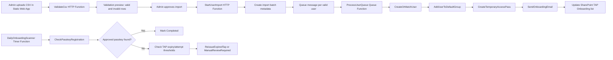

# TAP Onboarding Application Architecture (Separate Module)

## 1) Architecture Summary

This TAP onboarding solution is a new, isolated module under `tap-onboarding/` and does not modify existing MFA onboarding code paths.

It reuses the existing operational model:

- Azure Functions (PowerShell 7.4) for backend orchestration
- Azure Static Web Apps (admin UI) for operator workflows
- Microsoft Graph for Entra user lifecycle, TAP, auth-method checks, and sendMail
- SharePoint Online list as primary workflow/state store
- Queue-backed per-user processing for scale and retry safety
- Managed identity for service-to-service auth where possible

High-level components:

1. Static Web App Admin UI
2. Function App (HTTP + Queue + Timer triggers)
3. Storage Queue (or Service Bus) for per-user jobs
4. SharePoint list `TAP Onboarding` for workflow records
5. Microsoft Graph integration service

## 2) Data Flow

Idempotency controls:

- Deterministic processing key per row: `ImportId + NormalizedUPN`
- Immutable `UserObjectId` used once known
- Action checkpoints in SharePoint fields and operation state
- Retry-safe action ordering and checks before each side effect

## 3) Required Microsoft Graph Endpoints

User and identity lifecycle:

- `GET /v1.0/users/{id-or-upn}`
- `POST /v1.0/users`
- `POST /v1.0/groups/{group-id}/members/$ref`

Temporary Access Pass:

- `POST /v1.0/users/{id}/authentication/temporaryAccessPassMethods`
- `GET /v1.0/users/{id}/authentication/temporaryAccessPassMethods`

Auth method registration checks:

- `GET /v1.0/users/{id}/authentication/methods`

Shared mailbox email sending:

- `POST /v1.0/users/{shared-mailbox-upn}/sendMail`

SharePoint list operations:

- `GET /v1.0/sites/{site-id}/lists/{list-id}/items?$expand=fields`
- `POST /v1.0/sites/{site-id}/lists/{list-id}/items`
- `PATCH /v1.0/sites/{site-id}/lists/{list-id}/items/{item-id}/fields`

Authorization checks in portal APIs:

- `GET /v1.0/me`
- `POST /v1.0/users/{id}/checkMemberGroups`

## 4) Proposed Graph Permissions

Application permissions for Function App managed identity:

- `User.Read.All` (read users)
- `User.ReadWrite.All` (create cloud users and update profile fields)
- `GroupMember.ReadWrite.All` (default group membership)
- `UserAuthenticationMethod.ReadWrite.All` (create TAP)
- `UserAuthenticationMethod.Read.All` (auth method reporting)
- `Mail.Send` (send onboarding email from shared mailbox endpoint)
- `Sites.Selected` preferred, or `Sites.ReadWrite.All` fallback for list operations

Delegated permissions for Static Web App admin client (UI token for admin APIs):

- `User.Read` (identity)
- Optional: no direct SharePoint/Graph data plane from browser; browser should call API only

Mailbox scope control:

- Restrict app-only `Mail.Send` to configured mailbox using Exchange Online Application Access Policy (or equivalent mailbox scoping)

## 5) SharePoint Column Schema

List name: `TAP Onboarding`

Recommended internal columns and types:

- `Title` (Single line text) - Suggested value: `${DisplayName} | ${UPN}`
- `UserObjectId` (Single line text)
- `UserPrincipalName` (Single line text)
- `FirstName` (Single line text)
- `LastName` (Single line text)
- `DisplayName` (Single line text)
- `OtherEmailAddress` (Single line text)
- `Department` (Single line text)
- `JobTitle` (Single line text)
- `UsageLocation` (Single line text)
- `OnboardingWave` (Single line text)
- `Status` (Choice)
- `UserCreatedDate` (Date/Time)
- `TAPIssuedDate` (Date/Time)
- `TAPExpiryDate` (Date/Time)
- `TAPAttempt` (Number)
- `TAPMethodId` (Single line text)
- `PasskeyRegistered` (Yes/No)
- `RegisteredAuthenticationMethods` (Multiple lines text)
- `RegistrationCompletedDate` (Date/Time)
- `LastCheckedDate` (Date/Time)
- `LastEmailSentDate` (Date/Time)
- `EmailDeliveryStatus` (Choice)
- `ErrorCode` (Single line text)
- `ErrorMessage` (Multiple lines text)
- `RequiresManualReview` (Yes/No)
- `CreatedByImportId` (Single line text)
- `ImportFileName` (Single line text)
- `ProcessingKey` (Single line text, unique where possible)
- `ExcludedFromOnboarding` (Yes/No)

Important:

- Never add/store TAP secret in SharePoint
- Use `UserObjectId` as immutable key

## 6) Azure Function List

HTTP functions:

- `ValidateCsv`
- `StartUserImport`
- `RetryFailedUser`
- `ReissueTapManual`
- `ResendOnboardingEmail`
- `GetDashboardSummary`
- `GetOnboardingUsers`
- `GetImportHistory`
- `GetConfiguration`
- `SaveConfiguration`

Queue/worker functions:

- `ProcessUserQueue`
- `CreateOrMatchUser`
- `AddUserToDefaultGroup`
- `CreateTemporaryAccessPass`
- `SendOnboardingEmail`

Timer functions:

- `DailyOnboardingScanner`
- `CheckPasskeyRegistration`
- `ReissueExpiredTap`

Phase 1 implementation delivered in this module includes:

- `ValidateCsv` (HTTP)
- `CreateOrMatchUser` (HTTP callable worker-style endpoint for initial validation and integration)
- Shared modules for config, CSV validation, Graph retry/auth, and SharePoint model mapping

## 7) Security Risks and Mitigations

Risk: TAP/password/PII leakage in logs

- Mitigation: structured logging with explicit field allowlists and redaction helpers
- Mitigation: do not persist TAP secret or generated password at any layer

Risk: Over-privileged Graph permissions

- Mitigation: separate app identities by concern where practical
- Mitigation: prefer `Sites.Selected`, mailbox scoping policy, and minimum app roles

Risk: Duplicate processing from retries

- Mitigation: processing key + idempotent pre-checks before side effects
- Mitigation: replay-safe status transitions and operation flags

Risk: Unauthorized admin access

- Mitigation: Entra-authenticated Static Web App, admin group membership checks, role model (Reader/Operator/Admin)

Risk: CSV injection and invalid identities

- Mitigation: strict schema validation, duplicate detection, unsupported character checks, explicit import approval gate

## 8) Assumptions and Open Questions

Assumptions:

- PowerShell Azure Functions remain the preferred backend implementation language
- SharePoint list remains the primary onboarding state store
- New TAP module may read from but will not mutate old MFA records unless explicitly needed for reporting

Open questions:

1. Should existing users default to included or excluded for TAP issuance during import approval?
2. Should pilot and broader waves be represented as fixed enum values or free-text wave labels?
3. Is Service Bus preferred over Storage Queue for future dead-letter/poison handling?
4. Is app-only mail sending mandatory from day one, or delegated mailbox send acceptable in non-prod?
5. Which passkey method types are approved for completion on day one beyond Authenticator passkey?

## Reuse Decisions (From Existing Repo)

Reuse unchanged:

- Function host baseline: `host.json`, `profile.ps1`, `requirements.psd1`
- Managed identity token and Graph invocation approach
- Ops/admin group membership gate pattern from admin settings APIs
- Deployment step style (numbered scripts + INI-driven config)

Extend:

- CSV validation from simple UPN checks to full TAP schema and duplicate/existence checks
- SharePoint list updater from basic invite tracking to TAP lifecycle state machine
- Existing auth-method reporting logic to passkey-specific completion evaluator

New modules required:

- TAP policy service and secure in-memory TAP handling
- Dedicated onboarding email templating with configurable links/branding
- Queue-based idempotent orchestration per user
- TAP reissue governance and manual-review escalation rules
